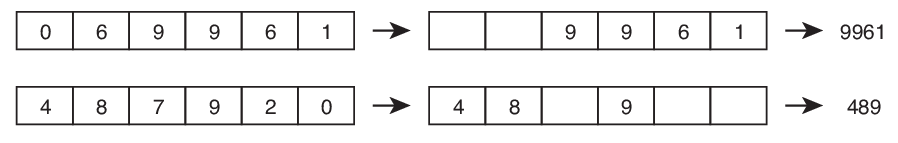

# Casamento de inteiros
Vamos definir a operação de casamento de dois números inteiros *A* e *B* da seguinte forma:
- inicialmente fazemos *A* e *B* terem o mesmo número de dígitos, adicionando zeros à esquerda
conforme necessário;
- então cada dígito de *A* (do menos significativo ao mais significativo) é comparado com o dígito
correspondente de *B*, e o dígito de menor valor é eliminado do número a que pertence (se os
dígitos são iguais nenhum é eliminado).
- o resultado da operação de casamento é o par de números inteiros formados pelos dígitos
remanescentes de *A* e *B*. No caso de não haver digito remanescente para um dos números, o
resultado para esse número é −1.

Por exemplo, considere o casamento de 69961 com 487920:

O resultado do casamento é o par de números 489 e 9961.

Dados dois números inteiros, sua tarefa é determinar o resultado do casamento desses dois números.
## Entrada
A primeira linha da entrada contém um número inteiro *A*, a segunda linha contém um número
inteiro *B*.
## Saída
Seu programa deve produzir uma única linha, contendo os dois números inteiros produzidos pelo
casamento dos números dados, em ordem não decrescente.
## Restrições
- 1 ≤ *A* ≤ 109
- 1 ≤ *B* ≤ 109
## Informações sobre a pontuação
- Para um conjunto de casos de testes valendo 22 pontos, 100 ≤ *A* ≤ 999 e 100 ≤ *B* ≤ 999.
- Para um conjunto de casos de testes valendo outros 78 pontos, nenhuma restrição adicional.

| Exemplo de entrada 1 | Exemplo de saída 1 |
| -------------------- | ------------------ |
| 69961                | 489 9961           |
| 487920               |                    |

| Exemplo de entrada 2 | Exemplo de saída 2 |
| -------------------- | ------------------ |
| 5678                 | -1 5678            |
| 1234                 |                    |

| Exemplo de entrada 3 | Exemplo de saída 3 |
| -------------------- | ------------------ |
| 21                   | 2 2                |
| 12                   |                    |

| Exemplo de entrada 4 | Exemplo de saída 4 |
| -------------------- | ------------------ |
| 200                  | 0 200              |
| 100                  |                    |
